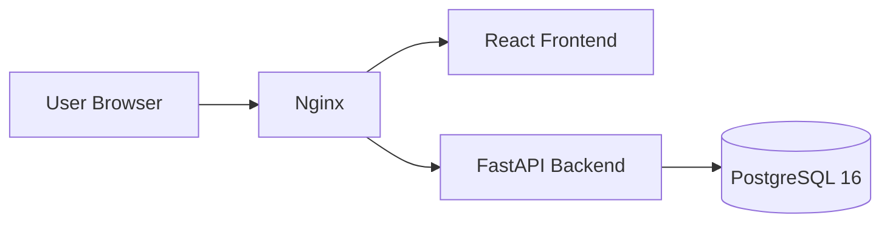

# CyberFusion AI

CyberFusion AI is an enterprise cybersecurity platform foundation for autonomous security operations and future threat detection workflows. Module 1 establishes the production-grade development base only. It intentionally does not include AI logic, threat intelligence engines, or detection features yet.

## What is included

- FastAPI backend foundation with application factory, settings, CORS, logging, middleware, OpenAPI, and health/version endpoints.
- PostgreSQL 16 integration through SQLAlchemy and Alembic.
- React 19 frontend with Vite, TailwindCSS, React Router, React Query, Axios, Hero Icons, and Framer Motion.
- Docker Compose stack for frontend, backend, and database.
- Nginx reverse proxy for the frontend container.

## Folder Structure

```text
CyberFusionAI/
├── backend/
├── frontend/
├── docker/
├── database/
├── scripts/
├── tests/
├── docs/
├── README.md
├── .gitignore
├── .env.example
├── docker-compose.yml
└── LICENSE
```

## Architecture



See [docs/architecture.md](docs/architecture.md) for the module-level foundation notes.

## Installation

1. Clone the repository.
2. Copy `.env.example` to `.env`.
3. Adjust the environment values for your local or containerized setup.

## Environment Variables

- `APP_NAME`
- `VERSION`
- `DEBUG`
- `ENVIRONMENT`
- `API_PREFIX`
- `DATABASE_URL`
- `ALLOWED_ORIGINS`
- `JWT_SECRET_KEY`
- `JWT_ALGORITHM`
- `JWT_ACCESS_TOKEN_EXPIRE_MINUTES`
- `POSTGRES_DB`
- `POSTGRES_USER`
- `POSTGRES_PASSWORD`

## Docker Setup

Run the full stack with:

```bash
docker compose up --build
```

Expected services:

- Frontend: `http://localhost:3000`
- Backend: `http://localhost:8000`
- Swagger UI: `http://localhost:8000/docs`
- Health endpoint: `http://localhost:8000/health`

## Development Setup

Backend:

```bash
cd backend
python -m venv .venv
.venv\Scripts\activate
pip install -r requirements.txt
uvicorn app.main:app --reload
```

Frontend:

```bash
cd frontend
npm install
npm run dev
```

## Commands

Backend:

- `uvicorn app.main:app --reload`
- `alembic upgrade head`

Frontend:

- `npm run dev`
- `npm run build`
- `npm run preview`

Containers:

- `docker compose up --build`
- `docker compose down`

## Future Roadmap

- Authentication and authorization.
- Role-based access control.
- Cybersecurity detection modules.
- Threat intelligence ingestion.
- AI-assisted operations workflows.
- Alerts, incidents, forensics, and asset enrichment pipelines.

## Notes

Module 1 is intentionally a foundation-only release. The current UI uses placeholder content so later security modules can be added without restructuring the platform.